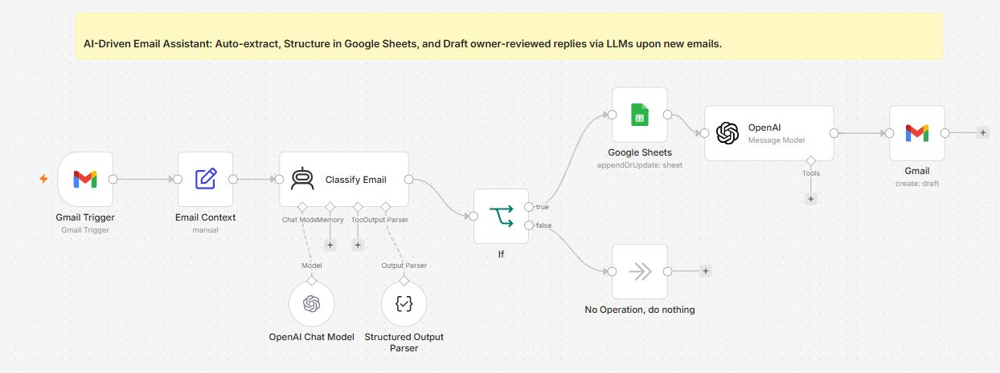

# 📧 AI Email Assistant using n8n, Gmail, Google Sheets & OpenAI


---

# 📌 Overview

The **AI Email Assistant** is an intelligent email automation workflow built using **n8n**, **OpenAI**, **Gmail API**, and **Google Sheets**.

Instead of manually reading every email, identifying important business inquiries, recording lead information, and writing replies, this workflow automates the complete process while keeping a **Human-in-the-Loop (HITL)** review step.

Whenever a new email arrives, the workflow:

* Monitors Gmail for incoming emails.
* Extracts sender information and email content.
* Uses an OpenAI model to classify whether the email is a sponsorship/business inquiry.
* Extracts structured information such as sender name, email address, company, and reasoning.
* Stores qualified leads in Google Sheets.
* Generates a professional email reply.
* Saves the response as a Gmail Draft for review before sending.

This approach increases productivity while ensuring that important emails receive consistent, professional responses without sending AI-generated replies automatically.

---

# ✨ Features

* 📩 Automatic Gmail monitoring
* 🤖 AI-powered email classification
* 🧠 Structured data extraction
* 📊 Google Sheets lead management
* ✉️ AI-generated professional replies
* 👨‍💼 Human review before sending
* 🔄 Automatic Gmail draft creation
* ⚡ No manual copy-pasting
* 📈 Lead tracking and organization
* 🧩 Easy to customize for different business use cases

---


## Workflow Layout



---

# 💡 Business Problem Solved

Businesses receive numerous emails every day, including:

* Sponsorship requests
* Partnership proposals
* Sales inquiries
* Collaboration requests
* Customer questions
* General notifications

Manually reviewing each email, recording lead information, and drafting responses consumes significant time.

This workflow automates:

* Email understanding
* Lead qualification
* Structured record keeping
* Reply drafting

while still allowing the user to review drafts before sending, making it suitable for professional communication.

---

# ⚙ Technologies Used

| Technology               | Purpose                                   |
| ------------------------ | ----------------------------------------- |
| n8n                      | Workflow automation platform              |
| Gmail API                | Receive emails and create drafts          |
| OpenAI GPT-4o Mini       | Email classification and reply generation |
| Google Sheets            | Store structured lead information         |
| Structured Output Parser | Parse AI responses into structured JSON   |
| IF Node                  | Route emails based on AI classification   |

---

# 🔑 Prerequisites

Before importing the workflow, configure your own credentials:

* n8n (latest version)
* Gmail OAuth2 Credentials
* Google Sheets OAuth2 Credentials
* OpenAI API Key
* Google Account
* Internet connection

> **Note:** This repository does **not** include API keys or company-specific credentials. Configure your own credentials in n8n before running the workflow.

---

# 🔐 Required Credentials

## 1. Gmail OAuth2

Used for:

* Reading incoming emails
* Creating Gmail drafts

Required permissions:

* Read Gmail messages
* Create drafts

---

## 2. Google Sheets OAuth2

Used for:

* Appending qualified email data into a spreadsheet

Required:

* Spreadsheet access
* Edit permission

---

## 3. OpenAI API

Used for:

* Email classification
* Information extraction
* Draft reply generation

Credential Type:

```text
OpenAI API
```

---

# 🚀 Installation

### Step 1

Clone the repository.

```bash
git clone https://github.com/<your-username>/n8n-email-ai-assistant.git
```

### Step 2

Import:

```text
Email_AI_Agent.json
```

into n8n.

### Step 3

Configure:

* Gmail OAuth2
* Google Sheets OAuth2
* OpenAI API

### Step 4

Update the Google Spreadsheet ID and Sheet Name.

### Step 5

Execute the workflow once manually to verify the configuration.

### Step 6

Activate the Gmail Trigger to start monitoring incoming emails.

---

# 🔄 Workflow Execution

Whenever a new email arrives in Gmail, the Gmail Trigger starts the workflow. The email details are first formatted into a structured context and then sent to an AI Agent powered by OpenAI GPT-4o Mini.

The AI determines whether the email is a sponsorship or business inquiry and extracts useful information such as sender details, company name, and reasoning. If the email matches the defined criteria, the extracted information is stored in Google Sheets. A second OpenAI node generates a professional reply, which is saved as a Gmail draft for manual review.

Emails that do not match the business criteria are routed to a "No Operation" node, allowing the workflow to ignore irrelevant messages without unnecessary processing.

---

# 📚 Node-by-Node Documentation

This section explains every node used in the workflow, its purpose, important configuration, inputs, outputs, and how data flows through the automation.

---

# 1️⃣ Gmail Trigger

**Node Type:** Gmail Trigger

**Purpose**

This is the starting point of the workflow. It continuously monitors your Gmail account and triggers the workflow whenever a **new email** is received.

The workflow uses Gmail OAuth2 authentication to securely access your mailbox.

### Important Parameters

| Parameter      | Value        |
| -------------- | ------------ |
| Resource       | Message      |
| Trigger        | New Email    |
| Authentication | Gmail OAuth2 |
| Polling        | Automatic    |

### Input

Incoming email including:

* Sender Name
* Sender Email
* Subject
* Email Body
* Thread ID
* Message ID
* Date

### Output

Returns the complete Gmail message JSON which is passed to the next node.

---

# 2️⃣ Email Context

**Node Type:** Set / Manual Node

## Purpose

Instead of sending the complete Gmail response to the AI, this node creates a clean email context.

It extracts only the information needed by the AI model.

Example Context

```text
From:
John Smith

Email:
john@example.com

Subject:
Sponsorship Opportunity

Body:
Hello, we'd like to collaborate with your company...
```

### Data Prepared

| Field        | Source        |
| ------------ | ------------- |
| Sender Name  | Gmail Trigger |
| Sender Email | Gmail Trigger |
| Subject      | Gmail Trigger |
| Body         | Gmail Trigger |

This makes the AI prompt cleaner and improves classification accuracy.

---

# 3️⃣ Classify Email (AI Agent)

**Node Type**

AI Agent

## Purpose

This is the core intelligence of the workflow.

The AI analyzes the incoming email and decides whether it is a genuine sponsorship or business inquiry.

It also extracts structured information that will later be stored in Google Sheets.

### AI Tasks

✔ Understand email intent

✔ Detect sponsorship requests

✔ Identify sender

✔ Extract company

✔ Generate reasoning

### Expected Output

The AI returns structured JSON similar to:

```json
{
  "isSponsorship": true,
  "lead_name": "John Smith",
  "lead_company": "ABC Technologies",
  "reasoning": "The sender is requesting a paid sponsorship collaboration."
}
```

### Why Structured Output?

Using structured JSON eliminates manual parsing and makes the workflow more reliable for downstream nodes.

---

# 4️⃣ OpenAI Chat Model

**Node Type**

OpenAI Chat Model

## Model Used

```text
gpt-4o-mini
```

## Purpose

Provides the language model used by the AI Agent.

Responsibilities include:

* Email understanding
* Entity extraction
* Intent classification
* JSON generation

### Required Credential

OpenAI API Key

### Recommended Settings

| Parameter       | Value           |
| --------------- | --------------- |
| Model           | GPT-4o Mini     |
| Temperature     | Default         |
| Response Format | Structured JSON |

---

# 5️⃣ Structured Output Parser

**Node Type**

Structured Output Parser

## Purpose

Ensures the AI always returns valid JSON instead of free-form text.

Without this node, AI responses may vary in formatting, making automation unreliable.

### Expected Schema

| Field         | Type    |
| ------------- | ------- |
| isSponsorship | Boolean |
| lead_name     | String  |
| lead_company  | String  |
| reasoning     | String  |

This guarantees consistent data for the IF node and Google Sheets.

---

# 6️⃣ IF Node

**Node Type**

IF

## Purpose

Determines whether the email should continue through the workflow.

### Condition

```text
isSponsorship == true
```

### True Branch

* Store data in Google Sheets
* Generate AI reply
* Create Gmail Draft

### False Branch

* Stop processing
* Execute "No Operation"

This prevents unnecessary processing of newsletters, spam, or irrelevant emails.

---

# 7️⃣ Google Sheets

**Node Type**

Google Sheets

## Purpose

Stores qualified business inquiries in a structured spreadsheet for tracking and future follow-up.

### Operation

```text
Append or Update Row
```

### Authentication

Google OAuth2

### Required Parameters

| Parameter       | Description                        |
| --------------- | ---------------------------------- |
| Spreadsheet     | Your Google Spreadsheet            |
| Sheet Name      | Leads                              |
| Operation       | Append or Update                   |
| Matching Column | Email (optional for deduplication) |

### Suggested Google Sheet Structure

| Name       | Email                                       | Company          | Subject              | Category    | Reasoning                      | Date        | Status        |
| ---------- | ------------------------------------------- | ---------------- | -------------------- | ----------- | ------------------------------ | ----------- | ------------- |
| John Smith | [john@example.com](mailto:john@example.com) | ABC Technologies | Sponsorship Proposal | Sponsorship | Business collaboration request | 19-Jul-2026 | Draft Created |

### Column Explanation

| Column    | Description                        |
| --------- | ---------------------------------- |
| Name      | Sender's name extracted by AI      |
| Email     | Sender email                       |
| Company   | Company identified by AI           |
| Subject   | Original email subject             |
| Category  | Sponsorship / Business             |
| Reasoning | AI explanation                     |
| Date      | Processing date                    |
| Status    | Draft Created / Reviewed / Replied |

This spreadsheet acts as a lightweight CRM for managing incoming opportunities.

---

# 8️⃣ OpenAI Message Model

**Node Type**

OpenAI Message Model

## Purpose

Generates a professional email reply based on the classified inquiry.

Instead of sending the email immediately, it creates a response that can be reviewed by a human.

### Prompt Goals

* Professional tone
* Friendly language
* Thank the sender
* Acknowledge the inquiry
* Express interest
* Keep the response concise

### Output

HTML-formatted email content ready for Gmail Draft creation.

---

# 9️⃣ Gmail

**Node Type**

Gmail

## Operation

```text
Create Draft
```

## Purpose

Creates a draft reply inside Gmail instead of sending the email automatically.

This allows the workflow owner to review and edit the message before sending.

### Required Parameters

| Parameter | Description                       |
| --------- | --------------------------------- |
| To        | Sender Email                      |
| Subject   | Original Subject or Reply Subject |
| Body      | AI Generated Reply                |
| Thread ID | Original Gmail Thread             |

### Why Draft Instead of Send?

* Human approval
* Prevent accidental AI responses
* Maintain communication quality
* Compliance with business review processes

---

# 🔟 No Operation

**Node Type**

No Operation

## Purpose

This node handles emails that do not match the sponsorship/business criteria.

Examples include:

* Spam
* Promotional newsletters
* Automated notifications
* Social media alerts
* Subscription emails

The workflow simply ends without performing any additional actions.

---

# 📊 Data Flow Summary

```text
Gmail Trigger
      │
      ▼
Email Context
      │
      ▼
AI Classification
      │
      ▼
Structured Output
      │
      ▼
IF Decision
 ┌───────────────┐
 │               │
Yes             No
 │               │
 ▼               ▼
Google Sheets   End
 │
 ▼
Generate Reply
 │
 ▼
Create Gmail Draft
```

---

# 🔒 Required Google Configuration

## Gmail OAuth

Permissions required:

* Read Gmail messages
* Create Gmail drafts

---

## Google Sheets OAuth

Permissions required:

* Read Spreadsheet
* Edit Spreadsheet

---

## Google Spreadsheet Settings

Create a spreadsheet named:

```text
Email Lead Tracker
```

Create a sheet named:

```text
Leads
```

Use the following header row:

| Name | Email | Company | Subject | Category | Reasoning | Date | Status |
| ---- | ----- | ------- | ------- | -------- | --------- | ---- | ------ |

This structure matches the workflow's purpose and makes it easy to track qualified inquiries and follow-up status.

---
# 📥 Sample Workflow Data

This section provides example inputs and outputs to help users understand how the workflow processes emails from start to finish.

---

# 📧 Sample Incoming Email

```text
From: John Smith <john.smith@abctech.com>

Subject: Sponsorship Opportunity

Hello,

We have been following your work and would like to discuss a paid sponsorship collaboration for our upcoming product launch.

If you're interested, we'd love to schedule a meeting next week.

Looking forward to hearing from you.

Best Regards,
John Smith
Marketing Manager
ABC Technologies
```

---

# 🤖 Sample AI Classification Output

After the email is processed by the AI Agent, the Structured Output Parser returns a JSON response similar to:

```json
{
  "isSponsorship": true,
  "lead_name": "John Smith",
  "lead_company": "ABC Technologies",
  "reasoning": "The sender is requesting a paid sponsorship collaboration."
}
```

This structured output is used by the IF node to determine whether the workflow should continue.

---

# 📊 Sample Google Sheet

Create a spreadsheet named:

```text
Email Lead Tracker
```

Create a sheet named:

```text
Leads
```

### Recommended Columns

| Name       | Email                                                   | Company          | Subject                 | Category    | Reasoning                    | Date        | Status        |
| ---------- | ------------------------------------------------------- | ---------------- | ----------------------- | ----------- | ---------------------------- | ----------- | ------------- |
| John Smith | [john.smith@abctech.com](mailto:john.smith@abctech.com) | ABC Technologies | Sponsorship Opportunity | Sponsorship | Paid collaboration request   | 19-Jul-2026 | Draft Created |
| Sarah Lee  | [sarah@xyzmedia.com](mailto:sarah@xyzmedia.com)         | XYZ Media        | Partnership Proposal    | Partnership | Business partnership inquiry | 20-Jul-2026 | Draft Created |

---

## 📑 Column Description

| Column    | Purpose                                                |
| --------- | ------------------------------------------------------ |
| Name      | Sender's full name extracted from the email            |
| Email     | Sender's email address                                 |
| Company   | Company or organization identified by AI               |
| Subject   | Original email subject                                 |
| Category  | AI-detected email category                             |
| Reasoning | Explanation generated by AI                            |
| Date      | Date when the workflow processed the email             |
| Status    | Workflow status (e.g., Draft Created, Replied, Closed) |

---

# ✉️ Sample Gmail Draft

**To**

```text
john.smith@abctech.com
```

**Subject**

```text
Re: Sponsorship Opportunity
```

**Body**

```html
Hello John,

Thank you for reaching out and for considering a collaboration with us.

We appreciate your interest and would be happy to explore the sponsorship opportunity further. We'll review the details internally and get back to you shortly with the next steps.

Looking forward to connecting with you.

Best regards,
Your Name
```

The workflow creates this as a **draft**, allowing the user to review and edit it before sending.

---

# 🌍 Use Cases

This workflow can be adapted for a variety of business scenarios, including:

* Sponsorship inquiry management
* Partnership request handling
* Customer support triage
* Sales lead qualification
* Recruitment email processing
* Startup contact management
* Influencer collaboration requests
* Agency client communication
* Business development workflows

---

# 🎯 Benefits

* Saves time by automating repetitive email processing
* Maintains a structured record of important inquiries
* Reduces manual data entry
* Ensures consistent, professional draft replies
* Keeps a human review step before sending responses
* Easy to customize for different business requirements

---

# 🔧 Customization Ideas

You can extend this workflow by:

* Supporting multiple email categories (Sales, HR, Support, Partnerships)
* Adding Slack or Microsoft Teams notifications
* Creating tasks in Trello, Jira, or Asana for qualified leads
* Sending approved leads to a CRM such as HubSpot or Salesforce
* Generating email summaries using AI
* Detecting email sentiment and priority
* Translating multilingual emails before classification
* Automatically assigning labels in Gmail
* Scheduling follow-up reminders

---

# ⚠️ Troubleshooting

| Problem                         | Possible Cause                         | Solution                                           |
| ------------------------------- | -------------------------------------- | -------------------------------------------------- |
| Gmail Trigger not firing        | OAuth expired                          | Reconnect Gmail credentials                        |
| Google Sheets not updating      | Incorrect Spreadsheet ID or Sheet Name | Verify spreadsheet configuration                   |
| AI classification fails         | Invalid OpenAI API key                 | Update the OpenAI credentials                      |
| Gmail draft not created         | Missing Gmail permissions              | Ensure Gmail OAuth has draft creation access       |
| Duplicate rows in Google Sheets | Append operation only                  | Use Append or Update with a unique matching column |
| Empty AI response               | Prompt or model issue                  | Verify prompt configuration and model availability |

---

# 🚀 Future Enhancements

Potential improvements for future versions:

* Support multiple AI models (OpenAI, Gemini, Claude)
* Integrate with CRM platforms
* Add sentiment analysis
* Include spam detection
* Generate multilingual draft replies
* Add approval through Slack or Telegram
* Store email attachments in Google Drive
* Add analytics dashboard for processed emails
* Implement follow-up reminders for unanswered leads

---
# ⭐ Support

If you found this project useful, consider giving it a **⭐ Star** on GitHub!

---
